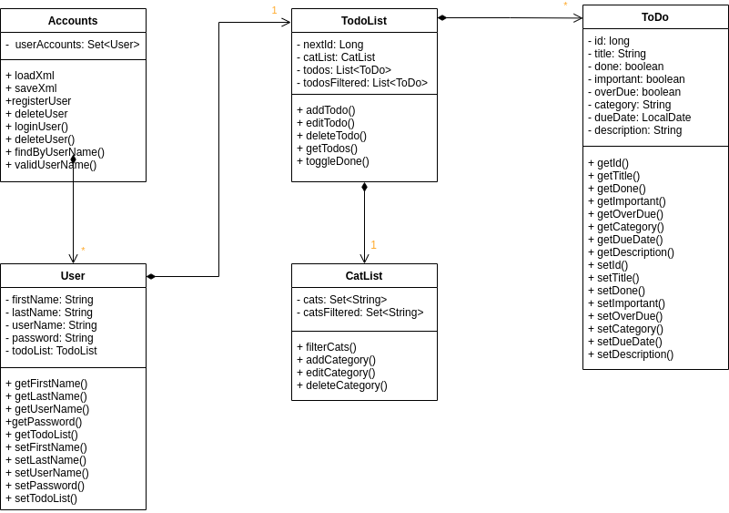
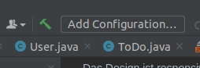
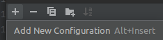
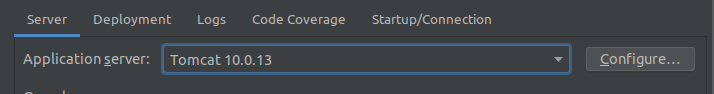
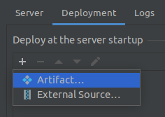
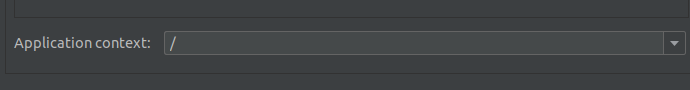

# ToDo Webapplication

## Inhaltsverzeichnis

* [Allgemein](#allgemein)
* [Desing](#design)
  * [Domänenmodell](#domnenmodell)
  * [Page flow](#page-flow)
  * [Klassendesign](#klassendesign)
* [Implementierung](#implementierung)
  * [Frontend](#frontend)
  * [Backend](#backend)
  * [REST-API](#backend)
  * [Zusätzliche Features](#zustzliche-features)
* [Verwendung](#verwendung)
  * [Voraussetzungen](#voraussetzungen)
* [Installation](#installation)

## Allgemein

Dieses Repository enthält eine ToDo Webapplikation die im Kontext eines CAS (Certificate of Advanced Studies) der Berner Fachhochschule implementiert wurde.
Mit der ToDo App können ToDos pro User erstellt, editiert und gelöscht werden. Die Daten werden persistent in einem XML im User Verzeichnis abgelegt.

Ein ToDo kann die folgenden Attribute enthalten:
- Titel*
- Kategorie
- Wichtigkeit (Boolean)
- Fälligkeitsdatum
- Beschreibung

In der Applikation ist eine Userauthorisierung implementiert mit welcher sich ein User registrieren und anmelden kann.
Pro User ist eine Todoliste verfügbar, die mehrere Todos enthalten kann. Die Applikation ist erweiterbar aufgebaut, damit ein User mehrere Todolisten mit jeweiligen Todos speichern kann.

Kategorien sind in der Applikation fünf verschiedene vorgegeben. 
Diese werden aus Designgründen in der Applikation unter anderem als Icons dargestellt, weshalb der Entscheid getroffen wurde, diese fix im Backend zu definieren.
Grundsätzlich ist es dynamisch aufgebaut, damit diese nur an einem Ort erweitert werden können.

## Design

### Domänenmodell



### Page Flow

### Klassendesign

## Implementierung

In diesem Kapitel werden einzelne Implementationen hervorgehoben und beschrieben. Es werden nicht alle Funktionen beschrieben.

### Frontend

Ein erster Entwurf für das Frontend wurde in der Applikation `Figma` entworfen. Dafür wurden jeweils 4 Views für Mobile und Desktop entworfen - Login-, Register-, TodoEdit- und TodoList-View.
Generell wurden im Frontend 2 Fonts geladen, `Roboto` als allgemeine Anzeigeschriftart und `Font-Awesome` für Icons. Funktionalitäten wurden jeweils über JSTL (Standard Tag Library) Tags `<c..>` oder über Scripting Elements `<%..%>` aufgerufen.  

#### Login-, Register-View

Login und Register sind mit Formularen gelöst, die jeweils durch ein Button submittet werden. Fehlermeldungen werden jeweils rot eingeblendet.

#### List-View

Die Liste der Todos wird über eine Tabelle angezeigt. Mit einem `<c:forEach>` Tag werden alle Todos des Users als Zeilen in die Tabelle abgefüllt.
In der View können die folgenden Funktionalitäten gebraucht werden:
- Todo check/uncheck
- Todo löschen
- Neues Todo hinzufügen
- Todo editieren
- Todo filtern

Fehlermeldungen werden jeweils rot eingeblendet.

##### Todo check/uncheck Button

Die Todo Checkbox wurde mittels eines Buttons umgesetzt, um bei einem Klick eine Aktivität im Backend auszulösen. 
Der Inhalt des Buttons wird dynamisch aus dem XML ausgelesen und als `Font-Awesome` Icon dargestellt. 

##### Kategorie

Einzelne Kategorien werden in der Todoliste als Icon dargestellt. Diese sind für den User einfacher erkennbar und voneinander trennbar. Wenn keine Kategorie ausgewählt wurde bleibt das Feld leer.

##### Kategorie Filter

Der Filter wird als Dropdown Menu dargestellt, welches aus einzelnen Buttons besteht. So kann jeder Button im Backend eine Aktion auslösen, die neue Daten an das Frontend senden kann.
Die Filter Auswahl wird dynamisch anhand der in den Todos gespeicherten Kategorien angezeigt.

#### Edit-View

In der Edit-View wird ein Todo erstellt oder bearbeitet. Die View wird dynamisch aufgebaut, je nach dem ob ein Todo bearbeitet oder neu erstellt wird.
Wenn ein bestehendees Todo bearbeitet wird, werden die Felder mit den Werten aus dem XML ausgefüllt. Zusätzlich wird noch die Checkbox und den `Delete-Todo-Button` eingeblendet. Die Kategorien werden auch hier mit einem Dropdown Menu ausgewählt.

### Backend

Das Backend kann in die folgenden drei Breiche unterteilt werden.

- Model
- Web Controller
- REST Controller

#### Model
###### Account
Das Model baut auf dem Singleton `Account` auf. Dieses verwaltet die User und die Persistenz.
Nebst den notwendigen Methoden für das Anlegen und Anmelden der User, wurde eine Methode für das Löschen der User vorbereitet, 
so wie Methoden für das Validieren von Credentials bei neuen Anmeldungen erstellt.

Die `Valiedierungs-Methoden` können nach Belieben erweitert werden, um z.B. beim Anlegen eines Passworts gewisse Mindestanforderungen zu prüfen
(aktuell wird nur auf ein nicht leeren String geprüft).

Bei der `Persistenz` gab es immer wieder einige Schwierigkeiten und Tücken, welche mehr Zeit und Augenmerk verlangten als zu Beginn angenommen wurde.
- Das Marshalling von Map's
- Fehlende Getter und/oder Setter
- Marshalling von static field's

###### User
Jeder User hat aktuell eine `TodoList`, welche alle seine ToDo's, so wie eine Liste mit den Kategorien beinhaltet.
Ein User könnte dem entsprechend mehrere, unterschiedliche Listen und pro Liste unterschiedliche Kategorien  verwalten (aktuell nicht implementiert).

###### TodoList
Die TodoList verwaltet alle ToDo's.
Hier werden alle CRUD so wie Filter und Sortier Operationen auf die ToDO's gehandelt.
Zudem wird hier die ID für neu Erstellte ToDo's generiert und verteilt.

Eine Spezialität hier ist die `FilteredList`, welche bei einer Anfrage zum Filtern nach einer bestimmen Kategorie abgefüllt wird.

###### CatList
Die Klasse CatList wurde vorgesehen für das Anlegen und Verwalten eigener Kategorien.
Aktuell beinhaltet diese fünf vordefinierte Werte.

###### TodoProcessor
Der TodoProcessor ist eine `Utility Klasse` zur Prozessierung von Eingehenden Daten vom Web und vom REST in neue ToDo Instanzen.
Hier wird z.B. ein Datum in String vom in ein LocalDate umgewandelt.

#### Web Controller
Die eingehenden Request's werden von vier Servlet's gehandelt.
Die Post's werden jeweils mit Hilfe von einem Switch Case ausgeführt.

Ungültige Request's werden jeweils mit `Exceptions` gehandelt. 

#### REST Controller
Analog zum Web Controller werden hier drei Servlets zum Handling der Requests verwendet.
Auch hier werden ungültige Requests durch Exceptions gehandelt.

### REST-API

Vor der Rest API ist ein Filter implementiert. Dieser wirft eine Exception, wenn ein unauthorisierter User eine Abfrage macht (ausser bei einem POST eines Users).
Über die API lassen sich über GET, POST, PUT und DELETE Daten einfügen, ändern oder löschen. 
Mit If-Else-Statements werden dabei alle möglichen Errors abgefangen.

### Zusätzliche Features

#### Responsive

Das Design ist responsive Mobile First aufgebaut. Die Tabelle und das Editmenu passen sich jeweils der Fensterbreite an.
Sobald die Fensterbreite eine breite eines Mobilen Geräts unterschreitet, ändert das Design in die Mobile View.
Dabei werden gewisse Abstände verkleinert, den Headtext ausgeblendet und die Buttons wichtigen Buttons werden im unteren Bereich des Displays dargestellt.
Die Tabelle in der Mobilen View ist Scrollbar.

## Verwendung

### Voraussetzungen

Voraussetzung für die Applikation ist ein Webserver, auf der deployed werden kann. 
In dieser Beschreibung wird beschrieben, wie die Applikation lokal auf einem Computer über die IDE IntelliJ auf einen lokalen TomCat server deployed wird (Tomcat und Intellij müssen installiert sein).

### Installation

1. Git Repository Klonen
```sh
git clone https://gitlab.ti.bfh.ch/cas-sd-hs21/group3/todo.git
```
3. Projekt in Intellij öffnen

4. Tomcat Konfiguration hinzufügen

   
5. Neue Konfiguration hinzufügen

    
6. Tomcat local auswählen
7. Lokale Tomcat instanz auswählen
   
    
8. `.war` deployen

   
9. `Todo:war exploded` auswählen
10. `Applicatin context` löschen

    
11. Run Tomcat

    
12. Browser [öffnen](http://localhost:8080/)

